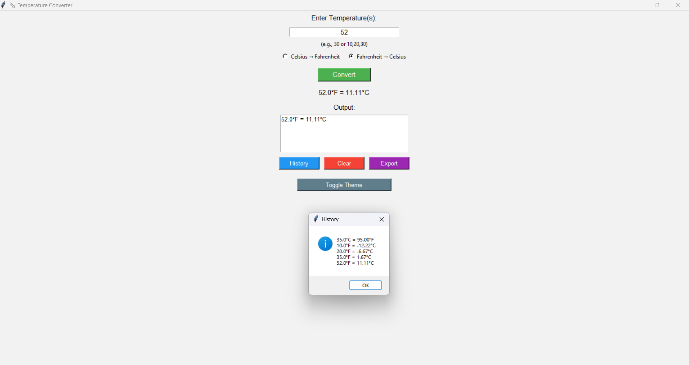
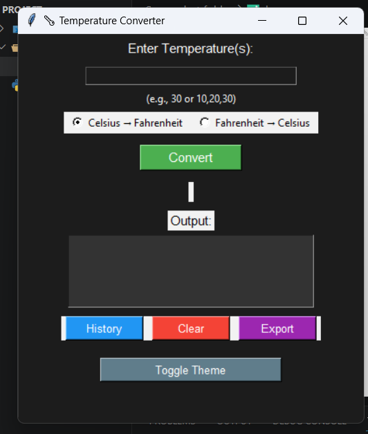

# 🌡️ Temperature Converter GUI

A desktop application built using **Python** and **Tkinter** that allows users to convert temperatures between Celsius and Fahrenheit through an interactive graphical interface.

The application includes additional features such as bulk conversion, conversion history tracking, Excel export functionality, dark/light theme switching, queue-based processing, and multithreading support.

---

## Features

* Convert Celsius to Fahrenheit
* Convert Fahrenheit to Celsius
* Bulk temperature conversion
* Conversion history tracking
* Queue-based processing
* Export conversion records to Excel (.xlsx)
* Dark and Light theme support
* Multithreading for background operations
* Input validation and error handling

---

## Technologies Used

* Python
* Tkinter
* Pandas
* Queue
* Threading

---

## Project Structure

```text
Temperature-Converter-GUI/
│
├── main.py
├── requirements.txt
├── README.md
├── .gitignore
└── Screenshot folder/
    ├── home.png
    └── dark-mode.png
```

## Installation

1. Clone the repository

```bash
git clone https://github.com/Omm13/Temperature-Converter-GUI.git
```

2. Navigate to the project folder

```bash
cd Temperature-Converter-GUI
```

3. Install dependencies

```bash
pip install -r requirements.txt
```

4. Run the application

```bash
python main.py
```

---

## Screenshots

### Main Interface



### Dark Mode



---

## Learning Objectives

This project was developed as a learning exercise to explore:

* GUI development using Tkinter
* Data processing using Pandas
* Multithreading concepts in Python
* Queue data structures
* File handling and Excel export
* User interface customization

---

## Author

**Omm Miriyala**

GitHub: https://github.com/Omm13
